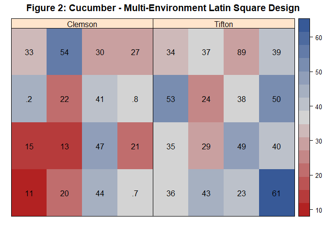
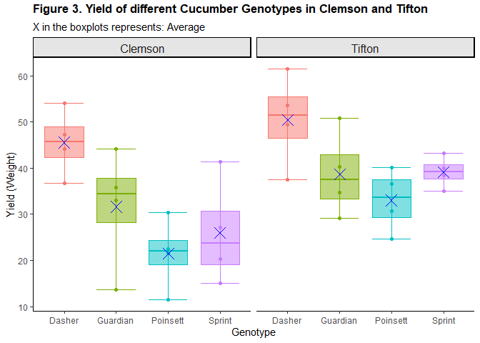
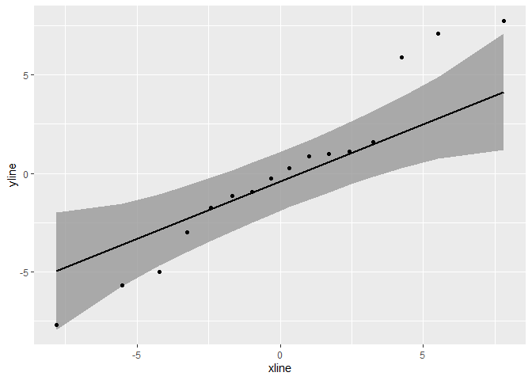
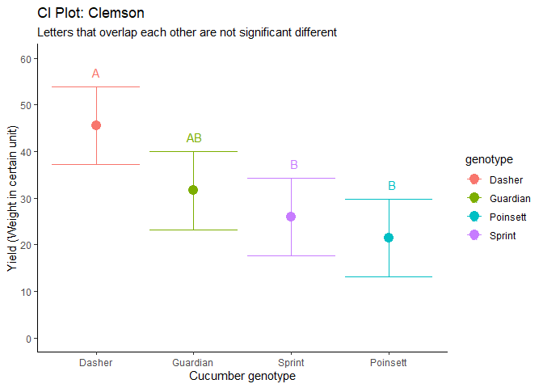
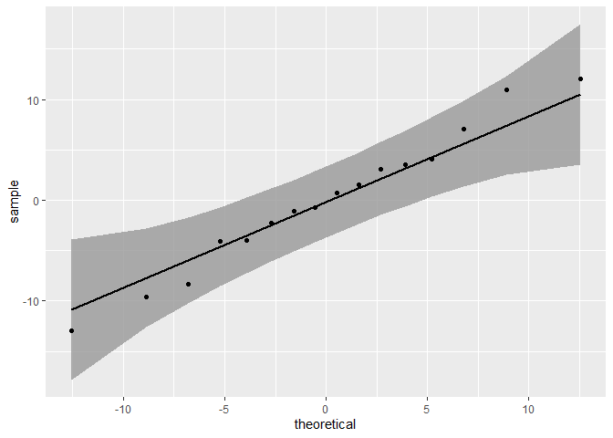
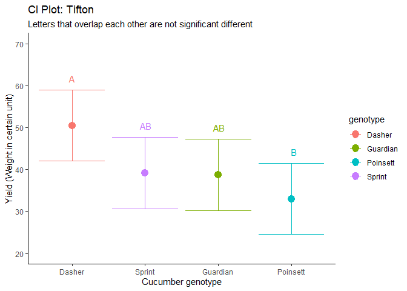
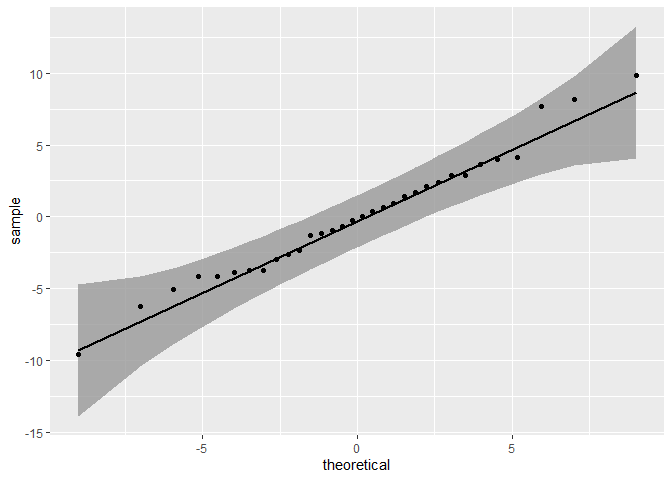

Cucumber: Multi-Environment Latin Square Field Experiment
================
Kar Ng
2021

-   [1 SUMMARY](#1-summary)
-   [2 R PACKAGES](#2-r-packages)
-   [3 INTRODUCTION](#3-introduction)
-   [3 EXPERIMENTAL DESIGN SUMMARY](#3-experimental-design-summary)
-   [4 DATA PREPARATION](#4-data-preparation)
    -   [4.1 SQL Data checking](#41-sql-data-checking)
    -   [4.2 SQL Data manipulation](#42-sql-data-manipulation)
    -   [4.3 Data import](#43-data-import)
    -   [4.4 Data description](#44-data-description)
    -   [4.4 Data exploration](#44-data-exploration)
-   [5 R DATA CLEANING AND
    MANIPULATION](#5-r-data-cleaning-and-manipulation)
-   [6 EXPLORATORY DATA ANALYSIS
    (EDA)](#6-exploratory-data-analysis-eda)
    -   [6.1 Desplot of Latin Square
        Design](#61-desplot-of-latin-square-design)
    -   [6.2 Which Cucumber Genotype Grows
        Better?](#62-which-cucumber-genotype-grows-better)
-   [7 STATISTICAL ANALYSIS](#7-statistical-analysis)
    -   [7.1 Latin Square in Clemson (Two-Way
        ANOVA)](#71-latin-square-in-clemson-two-way-anova)
    -   [7.2 Latin Square in Tifton (One-Way
        ANOVA)](#72-latin-square-in-tifton-one-way-anova)
    -   [7.3 Multi-Environment
        Latin-Square](#73-multi-environment-latin-square)
-   [8 RESULT SUMMARY](#8-result-summary)
-   [9 CONCLUSION](#9-conclusion)
-   [10 LEGALITY](#10-legality)
-   [11 REFERENCE](#11-reference)

------------------------------------------------------------------------


------------------------------------------------------------------------

Reading time: 16 minutes

## 1 SUMMARY

This project uses a dataset collected from a cucumber genotype
experiment. The experiment was carried out using an agriculture research
system called “Latin Square Design” and the experiment was repeated in 2
locations. This type of experiment is commonly called multi-environment
Latin Square Design. The main interest of this experiment is to
statistically compare 4 different cucumber genotypes (or varieties).

Analysis in this projects were split into 3 sections. First section
(section 7.1) imagined that the experiment was only conducted in the
first location, the second section (section 7.2) imagined that the
experiment was only conducted in the second location, and the last
section (section 7.3) is an overall statistical analysis that analysed
the overall dataset with the effect of locations (technically known as
“environments”) being taken into account. Please note that the first two
sections were just additional sections/works to demonstrate my
analytically skill in analysising common Latin Square designed research
system.

Final statistical result was achieved by a multi-environment Latin
Square model that took environment aspects and other random effects into
consideration when computing the statistical output. Result revealed
that cucumber genotype “Dasher” was the best performing cucumber
variety, followed by “Guardian”, “Sprint”, and “Poinsett” genotype.
“Dasher” genotype was significantly higher than genotypes “Sprint” and
“Poinsett” in yield, but it was not significantly higher than “Guardian”
genotype.

<br/>

*Highlights*

<br/>


<br/>

## 2 R PACKAGES

R packages loaded in this project include tidyverse packages (ggplot2,
dplyr, tidyr, readr, purrr, tibble, stringr, and forcats), skimr,
lubridate, kableEtra, agridat, MASS, DescTools, DescTools, lme4,
qqplotr, lsmeans, multcomp, and desplot.

``` r
library(tidyverse)
library(skimr)
library(lubridate)
library(kableExtra)
library(agridat)
library(MASS)
library(DescTools)
library(lme4)
library(lmerTest)
library(qqplotr)
library(lsmeans)
library(multcomp)
library(desplot)
library(DT)
```

## 3 INTRODUCTION

This is a personal project uses a public dataset that has dual
agricultural systems. The dataset was collected from an agriculture
research system named “Latin Square” and the system was repeated in two
locations. The experiment was carried out at Clemson university in South
Carolina, and Tifton in Georgia in 1985.

The involvement of more than one research location is often referred as
multi-environment, and the experiment is often called a
multi-environment research system. The environment of the two locations
might be different to a certain extent and would have noticeable or
unnoticeable impact on the experiment. Identifying that it is a
multi-environment system will help the researcher to take environment
aspects into account during statistical analysis, and to quantify the
impacts from these environments. This will help to achieve a more
accurate statistical conclusion.

Latin Square Design on the other hand is a common technique applied to
control known and unknown variations in the field. For example of known
variations, Latin Square Design is commonly used when there are more
than 2 sources of environmental variations. Latin Square Design splits
the plot of Latin Square system in a way that all treatments will have a
maximised chance experiencing these variations. A typical example would
be that the (1) soil condition from one side is more favor to plant
growth (such as higher in moisture) than in another side of the
allocated research field, and (2) the experimental field is adjacent to
the road. Position towards the sun also can be another variation in the
field. To account for these variations that would potentially impact the
experiment to an extent, a Latin Square design is adopted. Latin Square
design can also be applied even if there is no known source of
variation. Although there is no known source of variation discovered by
the researchers’ initial assessment, a Latin Square can still be adopted
as a system that ensuring each treatment is fairly split in the field to
minimise impact from these hidden sources of variation.

When analysing a Latin Square system, if the Latin Square design have
plots arranged based on known source of variations, a two-way analysis
of variance can be adopted. If Latin Square design is adopted in a field
without known source of variation, an one-way analysis of variance could
be adopted. Actually, the data structure of a Latin Square designed
experiment has “row” and “column” recorded to identify each plot in the
field. Therefore, one can still adopt a two-way analysis of variance in
a design that has no known source of variation to statistically find out
are there differences between rows and columns. A mixed effect model can
also be used for a Latin Square system that takes rows and columns as
random effects. A major disadvantage of Latin Square is that it can only
handle no more than 4 treatments.

This project will analyse the Latin Square system in two ways, one is a
typical Latin Square design analysis for two of the locations and
pretending that they are two unrelated experiment. It is just to
demonstrate how I would analyse the data if I am given a research
dataset from a Latin Square designed system. The other way (Final way)
is a overall multi-environment Latin Square Design analysis. It is the
true way of analysing this dataset by analysing all data together with
consideration of environmental aspects and other random effects.

## 3 EXPERIMENTAL DESIGN SUMMARY

Following is the quick summary of this analysis project.

-   **Crop**: Cucumber  
-   **Experimental Design**: Multi-Environment Latin Square  
-   **Experimental unit**: Latin Square plot (identified by row and
    column id)  
-   **Independent variables**: genotype
-   **Levels of independent variable**: 4 genotypes  
-   **Number of environment**: 2  
-   **Number of treatment group**: 8 (4 genotypes x 2 Environment)
-   **Total number of plots**: 32 (16 per environment)
-   **Number of replication**: 4  
-   **Dependent variable**: Yield (weight of marketable fruit per plot)

## 4 DATA PREPARATION

The dataset can be assessed through a R package named “agridat” and
imported using following code (click the right button). Following table
is the result of successful data import.

``` r
data("bridges.cucumber")
bridges.cucumber
```

    ##        loc      gen row col   yield
    ## 1  Clemson   Dasher   1   3 44.2000
    ## 2  Clemson   Dasher   2   4 54.1000
    ## 3  Clemson   Dasher   3   2 47.2000
    ## 4  Clemson   Dasher   4   1 36.7000
    ## 5  Clemson Guardian   1   4 33.0000
    ## 6  Clemson Guardian   2   2 13.6000
    ## 7  Clemson Guardian   3   1 44.1000
    ## 8  Clemson Guardian   4   3 35.8000
    ## 9  Clemson Poinsett   1   1 11.5000
    ## 10 Clemson Poinsett   2   3 22.4000
    ## 11 Clemson Poinsett   3   4 30.3000
    ## 12 Clemson Poinsett   4   2 21.5000
    ## 13 Clemson   Sprint   1   2 15.1000
    ## 14 Clemson   Sprint   2   1 20.3000
    ## 15 Clemson   Sprint   3   3 41.3000
    ## 16 Clemson   Sprint   4   4 27.1000
    ## 17  Tifton   Dasher   1   3 53.5463
    ## 18  Tifton   Dasher   2   4 37.5220
    ## 19  Tifton   Dasher   3   2 49.3943
    ## 20  Tifton   Dasher   4   1 61.4758
    ## 21  Tifton Guardian   1   4 34.7026
    ## 22  Tifton Guardian   2   2 29.1300
    ## 23  Tifton Guardian   3   1 40.2423
    ## 24  Tifton Guardian   4   3 50.7930
    ## 25  Tifton Poinsett   1   1 36.5749
    ## 26  Tifton Poinsett   2   3 24.6696
    ## 27  Tifton Poinsett   3   4 30.7489
    ## 28  Tifton Poinsett   4   2 40.0661
    ## 29  Tifton   Sprint   1   2 35.0771
    ## 30  Tifton   Sprint   2   1 43.3040
    ## 31  Tifton   Sprint   3   3 38.4251
    ## 32  Tifton   Sprint   4   4 39.9119

However, in order to show that I use **SQL** programming language, I
have downloaded the dataset and uploaded it to a database platform named
**BigQuery**. I will perform data checking and cleaning on the database
with SQL programming language, although I can perform all of these steps
in R. **BigQuery** is a widely used online database that allow users to
work with data with SQL programming language.

### 4.1 SQL Data checking

Following picture shows that I have checked the dataset with SQL codes,
and all columns turn out to be perfect and has no missing data, typos,
duplicates, or unwanted spaces within strings or numerical data that
need to be trimmed.

-   1.  Checking location names with the column “loc”: **Perfect**  

-   2.  Checking genotype names with the column “gen”: **Perfect**  

-   3.  Checking the “row” column: **Perfect**  

-   4.  Checking the “col” column: **Perfect**  

-   5.  Checking the “yield” column: **Perfect**

-   6.  There is one additional column needs to be removed:
        “**int64\_field\_0**”.

<br/>


<br/>

### 4.2 SQL Data manipulation

The dataset obviously has been cleaned by the dataset creator. In this
section, I am using the SQL again to change the name of variables, it is
an optional step but it comes with an advantage that the column name can
be more understandable for readers from other industries.

Following picture shows how I changed the column names from:

-   “loc” to “*location*”  
-   “gen” to “*genotype*”  
-   “col” to “*column*”

During this operation, the additional column that needs to be cleaned,
“int64\_field\_0”, has also been removed.

SQL codes:

<br/>


<br/>

After completing this step, the dataset is downloaded from the database.

### 4.3 Data import

The dataset is then uploaded to R using following codes. Following table
is an indication of successful data import.

``` r
cucum <- read_csv("cucum_sqlcleaned.csv")
cucum
```

    ## # A tibble: 32 x 5
    ##    location genotype   row column yield
    ##    <chr>    <chr>    <dbl>  <dbl> <dbl>
    ##  1 Clemson  Dasher       1      3  44.2
    ##  2 Clemson  Dasher       2      4  54.1
    ##  3 Clemson  Dasher       3      2  47.2
    ##  4 Clemson  Dasher       4      1  36.7
    ##  5 Clemson  Guardian     1      4  33  
    ##  6 Clemson  Guardian     2      2  13.6
    ##  7 Clemson  Guardian     3      1  44.1
    ##  8 Clemson  Guardian     4      3  35.8
    ##  9 Clemson  Poinsett     1      1  11.5
    ## 10 Clemson  Poinsett     2      3  22.4
    ## # ... with 22 more rows

### 4.4 Data description

Following table describes the variables in this dataset.

``` r
Variable <- c("location",
              "genotype",
              "row",
              "column",
              "yield")

Description <- c("The two locations involved in this research are Clemson and Tifton.", 
                 "Four cucumber genotypes are Dasher, Guardian, Sprint, Poinsett.", 
                 "The row id of the observation.",
                 "The column id of the observation.",
                 "Weight of marketable fruit per plot, unit not given.")

data.frame(Variable, Description) %>% 
  kbl() %>% 
  kable_styling(bootstrap_options = c("hover", "striped", "bordered"))
```

<table class="table table-hover table-striped table-bordered" style="margin-left: auto; margin-right: auto;">
<thead>
<tr>
<th style="text-align:left;">
Variable
</th>
<th style="text-align:left;">
Description
</th>
</tr>
</thead>
<tbody>
<tr>
<td style="text-align:left;">
location
</td>
<td style="text-align:left;">
The two locations involved in this research are Clemson and Tifton.
</td>
</tr>
<tr>
<td style="text-align:left;">
genotype
</td>
<td style="text-align:left;">
Four cucumber genotypes are Dasher, Guardian, Sprint, Poinsett.
</td>
</tr>
<tr>
<td style="text-align:left;">
row
</td>
<td style="text-align:left;">
The row id of the observation.
</td>
</tr>
<tr>
<td style="text-align:left;">
column
</td>
<td style="text-align:left;">
The column id of the observation.
</td>
</tr>
<tr>
<td style="text-align:left;">
yield
</td>
<td style="text-align:left;">
Weight of marketable fruit per plot, unit not given.
</td>
</tr>
</tbody>
</table>

### 4.4 Data exploration

Following table summarises the data structure of the dataset.

This cucumber dataset has 32 rows and 5 columns. Among the 5 columns,
“location” and “genotype” are classified as “character” variables,
whereas “row”, “column”, and “yield” are classified as “numeric”
variable.

------------------------------------------------------------------------

``` r
skim_without_charts(cucum)
```

<table style="width: auto;" class="table table-condensed">
<caption>
Data summary
</caption>
<thead>
<tr>
<th style="text-align:left;">
</th>
<th style="text-align:left;">
</th>
</tr>
</thead>
<tbody>
<tr>
<td style="text-align:left;">
Name
</td>
<td style="text-align:left;">
cucum
</td>
</tr>
<tr>
<td style="text-align:left;">
Number of rows
</td>
<td style="text-align:left;">
32
</td>
</tr>
<tr>
<td style="text-align:left;">
Number of columns
</td>
<td style="text-align:left;">
5
</td>
</tr>
<tr>
<td style="text-align:left;">
\_\_\_\_\_\_\_\_\_\_\_\_\_\_\_\_\_\_\_\_\_\_\_
</td>
<td style="text-align:left;">
</td>
</tr>
<tr>
<td style="text-align:left;">
Column type frequency:
</td>
<td style="text-align:left;">
</td>
</tr>
<tr>
<td style="text-align:left;">
character
</td>
<td style="text-align:left;">
2
</td>
</tr>
<tr>
<td style="text-align:left;">
numeric
</td>
<td style="text-align:left;">
3
</td>
</tr>
<tr>
<td style="text-align:left;">
\_\_\_\_\_\_\_\_\_\_\_\_\_\_\_\_\_\_\_\_\_\_\_\_
</td>
<td style="text-align:left;">
</td>
</tr>
<tr>
<td style="text-align:left;">
Group variables
</td>
<td style="text-align:left;">
None
</td>
</tr>
</tbody>
</table>

**Variable type: character**

<table>
<thead>
<tr>
<th style="text-align:left;">
skim\_variable
</th>
<th style="text-align:right;">
n\_missing
</th>
<th style="text-align:right;">
complete\_rate
</th>
<th style="text-align:right;">
min
</th>
<th style="text-align:right;">
max
</th>
<th style="text-align:right;">
empty
</th>
<th style="text-align:right;">
n\_unique
</th>
<th style="text-align:right;">
whitespace
</th>
</tr>
</thead>
<tbody>
<tr>
<td style="text-align:left;">
location
</td>
<td style="text-align:right;">
0
</td>
<td style="text-align:right;">
1
</td>
<td style="text-align:right;">
6
</td>
<td style="text-align:right;">
7
</td>
<td style="text-align:right;">
0
</td>
<td style="text-align:right;">
2
</td>
<td style="text-align:right;">
0
</td>
</tr>
<tr>
<td style="text-align:left;">
genotype
</td>
<td style="text-align:right;">
0
</td>
<td style="text-align:right;">
1
</td>
<td style="text-align:right;">
6
</td>
<td style="text-align:right;">
8
</td>
<td style="text-align:right;">
0
</td>
<td style="text-align:right;">
4
</td>
<td style="text-align:right;">
0
</td>
</tr>
</tbody>
</table>

**Variable type: numeric**

<table>
<thead>
<tr>
<th style="text-align:left;">
skim\_variable
</th>
<th style="text-align:right;">
n\_missing
</th>
<th style="text-align:right;">
complete\_rate
</th>
<th style="text-align:right;">
mean
</th>
<th style="text-align:right;">
sd
</th>
<th style="text-align:right;">
p0
</th>
<th style="text-align:right;">
p25
</th>
<th style="text-align:right;">
p50
</th>
<th style="text-align:right;">
p75
</th>
<th style="text-align:right;">
p100
</th>
</tr>
</thead>
<tbody>
<tr>
<td style="text-align:left;">
row
</td>
<td style="text-align:right;">
0
</td>
<td style="text-align:right;">
1
</td>
<td style="text-align:right;">
2.50
</td>
<td style="text-align:right;">
1.14
</td>
<td style="text-align:right;">
1.0
</td>
<td style="text-align:right;">
1.75
</td>
<td style="text-align:right;">
2.50
</td>
<td style="text-align:right;">
3.25
</td>
<td style="text-align:right;">
4.00
</td>
</tr>
<tr>
<td style="text-align:left;">
column
</td>
<td style="text-align:right;">
0
</td>
<td style="text-align:right;">
1
</td>
<td style="text-align:right;">
2.50
</td>
<td style="text-align:right;">
1.14
</td>
<td style="text-align:right;">
1.0
</td>
<td style="text-align:right;">
1.75
</td>
<td style="text-align:right;">
2.50
</td>
<td style="text-align:right;">
3.25
</td>
<td style="text-align:right;">
4.00
</td>
</tr>
<tr>
<td style="text-align:left;">
yield
</td>
<td style="text-align:right;">
0
</td>
<td style="text-align:right;">
1
</td>
<td style="text-align:right;">
35.74
</td>
<td style="text-align:right;">
12.16
</td>
<td style="text-align:right;">
11.5
</td>
<td style="text-align:right;">
28.62
</td>
<td style="text-align:right;">
36.64
</td>
<td style="text-align:right;">
43.50
</td>
<td style="text-align:right;">
61.48
</td>
</tr>
</tbody>
</table>

------------------------------------------------------------------------

There is no missing value in the dataset by examining the columns
**n\_missing** and **complete\_rate**. The **complete\_rate** of all
variables is 1, meaning 100% completion, and there is no missing value.
However, it is a little bit tricky that if missing value are filled up
into the dataset by the data uploader as string information such as
“NULL” or “Missing Value”, then they will not be detected by this
exploration method. However, this possibility has been eliminated as I
have examine this possility in the SQL section. A part from that I can
also see that there are no “white space” to trim.

To be more efficient in data exploration, I will convert the variable
type of “location”, “genotype”, “row”, and “column” from their current
type to factor type.

Here is another way to quicky glimpse the dataset and their type.

``` r
glimpse(cucum)
```

    ## Rows: 32
    ## Columns: 5
    ## $ location <chr> "Clemson", "Clemson", "Clemson", "Clemson", "Clemson", "Clems~
    ## $ genotype <chr> "Dasher", "Dasher", "Dasher", "Dasher", "Guardian", "Guardian~
    ## $ row      <dbl> 1, 2, 3, 4, 1, 2, 3, 4, 1, 2, 3, 4, 1, 2, 3, 4, 1, 2, 3, 4, 1~
    ## $ column   <dbl> 3, 4, 2, 1, 4, 2, 1, 3, 1, 3, 4, 2, 2, 1, 3, 4, 3, 4, 2, 1, 4~
    ## $ yield    <dbl> 44.2000, 54.1000, 47.2000, 36.7000, 33.0000, 13.6000, 44.1000~

“chr” in R stands for character variable type, “dbl” stands for double
which is typically used for numerical variables in R, and the data type
I am converting the “location”, “genotype”, “row”, and “column” into is
called “factor”, or abbreviated as “fct”.

## 5 R DATA CLEANING AND MANIPULATION

Following code complete the conversion (click the right button).

``` r
cucum <- cucum %>% 
  mutate(location = as.factor(location),
         genotype = as.factor(genotype),
         row = as.factor(row),
         column = as.factor(column)
         )
```

Glimpse the dataset again, the conversion has been successful.

``` r
glimpse(cucum)
```

    ## Rows: 32
    ## Columns: 5
    ## $ location <fct> Clemson, Clemson, Clemson, Clemson, Clemson, Clemson, Clemson~
    ## $ genotype <fct> Dasher, Dasher, Dasher, Dasher, Guardian, Guardian, Guardian,~
    ## $ row      <fct> 1, 2, 3, 4, 1, 2, 3, 4, 1, 2, 3, 4, 1, 2, 3, 4, 1, 2, 3, 4, 1~
    ## $ column   <fct> 3, 4, 2, 1, 4, 2, 1, 3, 1, 3, 4, 2, 2, 1, 3, 4, 3, 4, 2, 1, 4~
    ## $ yield    <dbl> 44.2000, 54.1000, 47.2000, 36.7000, 33.0000, 13.6000, 44.1000~

Following is the summary of the dataset.

``` r
summary(cucum)
```

    ##     location      genotype row   column     yield      
    ##  Clemson:16   Dasher  :8   1:8   1:8    Min.   :11.50  
    ##  Tifton :16   Guardian:8   2:8   2:8    1st Qu.:28.62  
    ##               Poinsett:8   3:8   3:8    Median :36.64  
    ##               Sprint  :8   4:8   4:8    Mean   :35.74  
    ##                                         3rd Qu.:43.50  
    ##                                         Max.   :61.48

-   There are 16 replicates for Clemson and Tifton respectively.  
-   There are 8 replicates for each genotype.
-   There are 8 replicates for each row and column.
-   The overall statistics of the yield of the dataset regardless of
    location and location, has a
    -   Fairly low minimum weight of 11.50 unit of weight.
    -   Fairly high maximum weight of 61.48 unit of weight.
    -   The mean and median is quite similar, with 36.64 and 35.74
        respectively.

A quick insight from the overall yield, I may stand a higher chance to
be able to see significant difference in my later statistical analysis
base on how far apart the minimum and maximum are from each other, as
well as the data may be normally distributed base on how close are the
median and mean to each other. These are just current assumptions, all
will be tested during statistical analysis.

## 6 EXPLORATORY DATA ANALYSIS (EDA)

### 6.1 Desplot of Latin Square Design

It will be interesting to plot out the typical layout of a Latin Square
design. Please note it is a simulation by the software and not represent
the true design from the experiment of this dataset by William Bridges
1989. Plot dimensions are not given.

There are 2 locations and 4 genotypes (or varieties) of cucumber in the
dataset. A Latin Square layout would be like:

``` r
desplot(data = cucum,
        form = yield ~ row*column | location,
        text = genotype,
        cex = 1,
        strip.cex = 1,
        col.regions = "white",
        col.text = "orange",
        main = "Figure 1: Cucumber - Multi-Environment Latin Square Design",
        out2 = genotype, 
        out2.gpar = list(col = "grey", lwd = 0.5, lty = 2)
        )
```

<!-- -->

Insights:

-   Each genotype are repeated 4 times in a location.  
-   In each location, each genotype are randomised in a Latin Square
    design way, which is row and column do not have repeated genotype.  
-   Both locations have the same layout and randomisation.

Following desplot shows that 4 plots located in the **bottom-left**
section of **Clemson** Latin Square is not favor for plant growth.

``` r
desplot(data = cucum,
        form = yield ~ row * column | location,
        text = yield,
        cex = 1,
        strip.cex = 1,
        show.key = F,
        main = "Figure 2: Cucumber - Multi-Environment Latin Square Design")
```

<!-- -->

Insights:

-   The numbers in each of the Latin Square plot is the actual real
    cucumber yield (weight in a certain unit, not given) from the
    dataset.  
-   4 plots in the bottom-left corner of Clemson are all red indicating
    the lowest yield, whereas the bottom-left corner of Tifton have
    better yield, despite both location have the exact same layout and
    genotype allocated to their bottom-left plots.  
-   The 4 plots in the bottom-left corner of Clemson are cucumber from 3
    genotypes
    -   Sprint (Sp) for 15 and 20
    -   Guardian (Gr) for 13
    -   Poinsett (Pn) for 11
-   Apart from the bottom left corner of Clemson, I can see that
    different color plots are randomly appear in both locations without
    a trend. It implies that the different in yield is likely to be the
    an effect of genotype, and the bottom left corner may somehow affect
    this conclusion to an certain extent during statistical analysis.
-   The low yield in the bottom left corner of Clemson is very likely
    due to uncontrollable or unnoticeable environment factor. It again
    highlights the benefit of Latin Square Design, the bottom left
    corner of Clemson affects 3 out of 4 of the genotype treatments,
    instead of affecting one particular treatment, and generating biased
    data.

### 6.2 Which Cucumber Genotype Grows Better?

Following figure visualise the yield of each cucumber genotype in the
dataset in both location.

``` r
ggplot(cucum, aes(x = genotype, y = yield, colour = genotype, fill = genotype)) +
  geom_boxplot(alpha = 0.5) +
  stat_boxplot(geom = "errorbar") +
  geom_point() +
  stat_summary(fun.y = mean, shape = 4, geom = "point", size = 5, colour = "blue") +
  facet_wrap(~location) +
  theme_classic() +
  theme(legend.position = "NA",
        strip.text = element_text(size = 12),
        strip.background = element_rect(fill = "grey90"),
        plot.title = element_text(face = "bold", size = 13, vjust = 2)) +
  labs(x = "Genotype",
       y = "Yield (Weight)",
       title = "Figure 3. Yield of different Cucumber Genotypes in Clemson and Tifton",
       subtitle = "X in the boxplots represents: Average")
```

<!-- -->

Insights:

-   Dasher is the best cucumber genotype in this dataset, which has the
    highest average yield in both location.  
-   Pointsett has the lowest yield cucumber genotype in both location.  
-   There is not much visually difference between the yield of genotypes
    Guardian and Sprint in both locations.  
-   Tifton seems to be a better growing environment for cucumber, all 4
    variety of cucumber yield better in Tifton than in Clemson.

## 7 STATISTICAL ANALYSIS

My statistical analysis is partitioned into 3 sections:

-   Clemson Latin Square system analysis  
-   Tifton Latin Square system analysis  
-   Multi-Environment Latin Square analysis (overall)

The statistical analysis of this project can actually be completed by
the third section alone. **Feel free to skip to section 7.3.**

However, I am completing the first 2 Latin Square design in their
respective environment is just to demonstrate how I would analyse a
non-multi-environment Latin square system.

### 7.1 Latin Square in Clemson (Two-Way ANOVA)

This section imagines that the experiment only launched in Clemson.

#### 7.1.1 Model buidling

Following code builds the model, the model is comprised of genotype, row
and column. I use a two-ways ANOVA because it would be my interest to
see how are yields statistically different from each other within rows
and columns. Rows and columns are my variables of interest now
especially after observing the problematic bottom-right corner of
Clemson in figure 2.

``` r
# filter to get Clemson only

cucum_clemson <- cucum %>% 
  filter(location == "Clemson")

# Model for Clemson

latinmodel_Clem <- lm(yield ~ genotype + row + column, 
                        data = cucum_clemson)
```

#### 7.1.2 Assumption test

**Normality test**

Residuals generated from the model of the dataset are normally
distributed, supported by,

-   The following Q-Q plot that most of the points are lying closed to
    the line and are mostly located within the 95% confidence shaded
    area around the line. However, there are a few points lying outside
    of the accepted shaded region. Generating a p-value test to help
    making a normality conclusion would be helpful.

``` r
cucum_clemson$resid <- resid(latinmodel_Clem)

ggplot(cucum_clemson, aes(sample = resid)) +
  stat_qq_band() +
  stat_qq_point() +
  stat_qq_line()
```

<!-- -->

-   A Shapiro-Wilk test is carried out, resulting P-value is higher than
    0.05, and thus the test fails to reject the null hypothesis and
    concludes that residuals in this model are normally distributed.

``` r
shapiro.test(resid(latinmodel_Clem))
```

    ## 
    ##  Shapiro-Wilk normality test
    ## 
    ## data:  resid(latinmodel_Clem)
    ## W = 0.95458, p-value = 0.5655

**Variance test**

Levene tests are carried out for each of the fixed effect in the model
to test for variance homogeneity. Results show that all variances in
each of the fixed effect variable (genotype, row, and column) are
homogeneous.

``` r
LeveneTest(yield ~ genotype, cucum) # equal variance
```

    ## Levene's Test for Homogeneity of Variance (center = median)
    ##       Df F value Pr(>F)
    ## group  3  0.0868 0.9667
    ##       28

``` r
LeveneTest(yield ~ row, cucum) # equal variance
```

    ## Levene's Test for Homogeneity of Variance (center = median)
    ##       Df F value Pr(>F)
    ## group  3    0.62 0.6079
    ##       28

``` r
LeveneTest(yield ~ column, cucum) # equal variance
```

    ## Levene's Test for Homogeneity of Variance (center = median)
    ##       Df F value Pr(>F)
    ## group  3   0.932 0.4383
    ##       28

#### 7.1.3 Omnibus test

Base on the assumption tests, a two-way anova is carried out. Result
shows that only yields among genotypes are significantly different from
each other with a P-value of close to 0.01.

``` r
anova(latinmodel_Clem)
```

    ## Analysis of Variance Table
    ## 
    ## Response: yield
    ##           Df  Sum Sq Mean Sq F value  Pr(>F)  
    ## genotype   3 1316.80  438.93  9.3683 0.01110 *
    ## row        3  528.35  176.12  3.7589 0.07872 .
    ## column     3  411.16  137.05  2.9252 0.12197  
    ## Residuals  6  281.12   46.85                  
    ## ---
    ## Signif. codes:  0 '***' 0.001 '**' 0.01 '*' 0.05 '.' 0.1 ' ' 1

#### 7.1.4 Post-hoc test

Following post-hoc test with P-value adjusted by Tukey method (alpha =
0.05) shows that genotype Dasher has the highest mean yield, and is
significantly different from Sprint and Poinsett. There is no
significant difference among Guardian, Sprint, and Poinsett Cucumber
genotype.

``` r
ls_clem <- lsmeans(latinmodel_Clem, ~genotype)
lscld_clem <- cld(ls_clem, Letters = LETTERS, reversed = T)
lscld_clem
```

    ##  genotype lsmean   SE df lower.CL upper.CL .group
    ##  Dasher     45.5 3.42  6     37.2     53.9  A    
    ##  Guardian   31.6 3.42  6     23.3     40.0  AB   
    ##  Sprint     25.9 3.42  6     17.6     34.3   B   
    ##  Poinsett   21.4 3.42  6     13.1     29.8   B   
    ## 
    ## Results are averaged over the levels of: row, column 
    ## Confidence level used: 0.95 
    ## P value adjustment: tukey method for comparing a family of 4 estimates 
    ## significance level used: alpha = 0.05 
    ## NOTE: Compact letter displays can be misleading
    ##       because they show NON-findings rather than findings.
    ##       Consider using 'pairs()', 'pwpp()', or 'pwpm()' instead.

A statistical graph that visualise the lower and upper confidence level
with the significance letters will be helpful.

``` r
ggplot(lscld_clem, aes(x = reorder(genotype, -lsmean), y = lsmean, colour = genotype)) +
  geom_point(size = 4) +
  geom_errorbar(aes(ymax = upper.CL, ymin = lower.CL)) +
  geom_text(aes(label = .group), vjust = -5) +
  theme_classic() +
  labs(x = "Cucumber genotype",
       y = "Yield (Weight in certain unit)",
       title = "Cl Plot: Clemson",
       subtitle = "Letters that overlap each other are not significant different") +
  scale_y_continuous(lim = c(0, 60), breaks = seq(0, 60, 10))
```

<!-- -->

### 7.2 Latin Square in Tifton (One-Way ANOVA)

This section imagines that the experiment only launched in Tifton.

#### 7.2.1 Model buidling

Following code builds the model. A one-way ANOVA will be sufficient, as
there is only one treatment now, which is the cucumber genotype and are
completely randomised within the plot of Tifton in the style of Latin
Square Design (Figure 2). Additionally, there is no any problematic
trend in the plots within the Latin Square design of Tifton that would
indicate differences may arise from row to row, or column to column.

``` r
# Filter out for a df that has only Tifton 
cucum_tifton <- cucum %>% 
  filter(location == "Tifton")  

# build the model  

latinmodel_tif <- lm(yield ~ genotype, data = cucum_tifton)  
```

#### 7.2.2 Assumption test

**Normality test**

Residuals generated from the model of the dataset are normally
distributed, supported by,

-   The following Q-Q plot that all of the points are lying closed to
    the straight line and are mostly within the 95% confidence shaded
    area around the line.

``` r
cucum_tifton$resid <- resid(latinmodel_tif)

ggplot(cucum_tifton, aes(sample = resid)) +
  stat_qq_band() +
  stat_qq_line() +
  stat_qq_point()
```

<!-- -->

-   A Shapiro-Wilk test is carried out, the resulting P-value is higher
    than 0.05, and thus the test fails to reject the null hypothesis and
    concludes that residuals in this model are normally distributed.

``` r
shapiro.test(resid(latinmodel_tif))
```

    ## 
    ##  Shapiro-Wilk normality test
    ## 
    ## data:  resid(latinmodel_tif)
    ## W = 0.98136, p-value = 0.9734

**Variance test**

Levene’s tests are carried out for the fixed effect in the model to test
for variance homogeneity. The test result shows that the variances among
the genotypes of cucumber are equal, with a P-value of 0.9667 (&gt;
P-val 0.05).

``` r
LeveneTest(yield ~ genotype, cucum) # equal variance
```

    ## Levene's Test for Homogeneity of Variance (center = median)
    ##       Df F value Pr(>F)
    ## group  3  0.0868 0.9667
    ##       28

#### 7.2.3 Omnibus test

A single ANOVA table shows that yield among the genotypes of cucumber is
significantly different from each other, with a P-value of 0.04588
(higher than P-value of 0.05).

``` r
anova(latinmodel_tif)
```

    ## Analysis of Variance Table
    ## 
    ## Response: yield
    ##           Df Sum Sq Mean Sq F value  Pr(>F)  
    ## genotype   3  642.2 214.068  3.5301 0.04855 *
    ## Residuals 12  727.7  60.642                  
    ## ---
    ## Signif. codes:  0 '***' 0.001 '**' 0.01 '*' 0.05 '.' 0.1 ' ' 1

#### 7.2.4 Post-hoc test

Dasher is the cucumber genotype that has the highest yield and is
significantly higher than Poinsett genotype. However, it is not
significantly different from Sprint and Guardian genotypes. Sprint and
Guardian cucumber genotypes are not significantly higher than Poinsett.

``` r
ls_tif <- lsmeans(latinmodel_tif, ~genotype)
lscld_tif <- cld(ls_tif, Letters = LETTERS, reversed = T)

lscld_tif
```

    ##  genotype lsmean   SE df lower.CL upper.CL .group
    ##  Dasher     50.5 3.89 12     42.0     59.0  A    
    ##  Sprint     39.2 3.89 12     30.7     47.7  AB   
    ##  Guardian   38.7 3.89 12     30.2     47.2  AB   
    ##  Poinsett   33.0 3.89 12     24.5     41.5   B   
    ## 
    ## Confidence level used: 0.95 
    ## P value adjustment: tukey method for comparing a family of 4 estimates 
    ## significance level used: alpha = 0.05 
    ## NOTE: Compact letter displays can be misleading
    ##       because they show NON-findings rather than findings.
    ##       Consider using 'pairs()', 'pwpp()', or 'pwpm()' instead.

A confidence interval plot (CI plot) to visualise the post-hoc result of
Tifton.

``` r
ggplot(lscld_tif, aes(x = reorder(genotype, -lsmean), y = lsmean, colour = genotype)) +
  geom_point(size = 4) +
  geom_errorbar(aes(ymax = upper.CL, ymin = lower.CL)) +
  geom_text(aes(label = .group), vjust = -6) +
  theme_classic() +
  labs(x = "Cucumber genotype",
       y = "Yield (Weight in certain unit)",
       title = "Cl Plot: Tifton",
       subtitle = "Letters that overlap each other are not significant different") +
  scale_y_continuous(lim = c(20, 70), breaks = seq(20, 70, 10))
```

<!-- -->

### 7.3 Multi-Environment Latin-Square

This table summarises the results from section 7.1 and 7.2 that
imagining the cucumber research were studied only in respective
location.

<br/>


<br/>

Again, as mentioned earlier, the section 7.1 and 7.2 are just additional
works to demonstrate how I would analyse individual Latin Square design.
The entire statistical analysis can be accomplished in this section 7.3.
This section applies multi-environment analysis and the results might be
differ from the above table.

<br/>

#### 7.3.1 Overall Fully Random Model

A full random model is built using following codes. In this model, I
include excessive possible random effects in the dataset into the model,
which include the genotype, location, and the interaction between
location with genotype, row, and column, as well as interaction between
genotype of row and column.

``` r
FRM <- lmer(yield ~ 
              (1|genotype) +
              (1|location) +
              (1|genotype:location) +
              (1|row:location) +
              (1|column:location) +
              (1|genotype:row) +
              (1|genotype:column),
            data = cucum
            )

summary(FRM)
```

    ## Linear mixed model fit by REML. t-tests use Satterthwaite's method [
    ## lmerModLmerTest]
    ## Formula: yield ~ (1 | genotype) + (1 | location) + (1 | genotype:location) +  
    ##     (1 | row:location) + (1 | column:location) + (1 | genotype:row) +  
    ##     (1 | genotype:column)
    ##    Data: cucum
    ## 
    ## REML criterion at convergence: 227.1
    ## 
    ## Scaled residuals: 
    ##      Min       1Q   Median       3Q      Max 
    ## -1.72288 -0.57428 -0.01889  0.42454  1.87095 
    ## 
    ## Random effects:
    ##  Groups            Name        Variance  Std.Dev.
    ##  genotype:column   (Intercept) 5.470e-06 0.002339
    ##  genotype:row      (Intercept) 3.752e-06 0.001937
    ##  column:location   (Intercept) 1.817e+01 4.262939
    ##  row:location      (Intercept) 3.170e+01 5.630708
    ##  genotype:location (Intercept) 0.000e+00 0.000000
    ##  genotype          (Intercept) 7.404e+01 8.604662
    ##  location          (Intercept) 2.801e+01 5.292454
    ##  Residual                      3.113e+01 5.579125
    ## Number of obs: 32, groups:  
    ## genotype:column, 16; genotype:row, 16; column:location, 8; row:location, 8; genotype:location, 8; genotype, 4; location, 2
    ## 
    ## Fixed effects:
    ##             Estimate Std. Error     df t value Pr(>|t|)  
    ## (Intercept)   35.743      6.303  2.737   5.671   0.0139 *
    ## ---
    ## Signif. codes:  0 '***' 0.001 '**' 0.01 '*' 0.05 '.' 0.1 ' ' 1
    ## optimizer (nloptwrap) convergence code: 0 (OK)
    ## boundary (singular) fit: see ?isSingular

The result of this model shows how well each possible group in the model
in explaining the variances in the model. The comparison is made by
proportion of variances by the overall variances in the group using
acquired variances from the above statistical result, the result of the
comparion is shown below.

``` r
FRM_var <- as.data.frame(VarCorr(FRM))
FRM_var %>% 
  mutate(pct_vcov = paste0(round(vcov / sum(vcov)*100,2), "%"),
         pct_vcov = format(pct_vcov, scientific = F)) %>% 
  arrange(desc(vcov)) %>% 
  dplyr::select(grp, pct_vcov) %>% 
  kbl(align = "c") %>% 
  kable_classic("hover")
```

<table class=" lightable-classic lightable-hover" style="font-family: &quot;Arial Narrow&quot;, &quot;Source Sans Pro&quot;, sans-serif; margin-left: auto; margin-right: auto;">
<thead>
<tr>
<th style="text-align:center;">
grp
</th>
<th style="text-align:center;">
pct\_vcov
</th>
</tr>
</thead>
<tbody>
<tr>
<td style="text-align:center;">
genotype
</td>
<td style="text-align:center;">
40.45%
</td>
</tr>
<tr>
<td style="text-align:center;">
row:location
</td>
<td style="text-align:center;">
17.32%
</td>
</tr>
<tr>
<td style="text-align:center;">
Residual
</td>
<td style="text-align:center;">
17%
</td>
</tr>
<tr>
<td style="text-align:center;">
location
</td>
<td style="text-align:center;">
15.3%
</td>
</tr>
<tr>
<td style="text-align:center;">
column:location
</td>
<td style="text-align:center;">
9.93%
</td>
</tr>
<tr>
<td style="text-align:center;">
genotype:column
</td>
<td style="text-align:center;">
0%
</td>
</tr>
<tr>
<td style="text-align:center;">
genotype:row
</td>
<td style="text-align:center;">
0%
</td>
</tr>
<tr>
<td style="text-align:center;">
genotype:location
</td>
<td style="text-align:center;">
0%
</td>
</tr>
</tbody>
</table>

Insights:

-   In the full random effect model that taking all environment into
    account, “genotype” is explaining the largest portion of the
    variance at 40.45%.  
-   It implies that genotype (or variety) of cucumber is the main effect
    in the model that causing differences in yield.  
-   Residual of 17% is a decently low level, which is desired.
-   Location (or “environment”) is only accounts for 15.3%, which
    indicates that location only explains the variances among data a
    little.  
-   Relationship between genotype and column, row, and location do not
    explain any variance (or explain less than a 0% level) in the
    dataset. It implies that there is no relationship effect.

<br/>

#### 7.3.2 Calculate repeatability of cucumber genotype

This section calculate repeatability of cucumber genotype. following
information are extracted from the above statistical result (section
7.3.1):

-   genotype variance: 74.02  
-   genotype:location: 0.00  
-   Number of location : 2  
-   Residual variance: 31.13  
-   Number of Replication: 4

``` r
# Var_X1/(Var_X1 + (Var_X1:Location/nLoc) + Var_Res/nLoc*nRep))

74.02/(74.02 + (0.00/2) + 31.13/(1*4))
```

    ## [1] 0.9048623

Estimated cucumber repeatability is 90.4%. This high level of
repeatability indicating that the genotypes are highly type performing,
and the environment involved in the experiment could be very stable.
This high level of repeatability also saying that any relevant, similar
study in the future, I would get the same result. However, this
repeatability can be affected by management and environmental conditions
that the future similar study has.

#### 7.3.3 Mixed Effect Model

**Building the Mixed Effect Model**

``` r
MEM <- lmer(yield ~ 
              genotype +
              (1|location) +
              (1|genotype:location) +
              (1|row:location) +
              (1|column:location),
            data = cucum)
```

**Assumption tests**

Assumptions of residual normality and variance homogeneity are met from
following tests.

1.  Shapiro-Wilk test for residuals normality has a P-value of 0.8569,
    which is a result that higher than 0.05, and concludes that the
    residuals are normally distributed.

``` r
shapiro.test(resid(MEM))
```

    ## 
    ##  Shapiro-Wilk normality test
    ## 
    ## data:  resid(MEM)
    ## W = 0.98206, p-value = 0.8569

2.  Q-Q plot to test for the overall residual normality, all points are
    forming a line, close to the straight line, and are falling within
    the 95% confidence interval. For this result, I conclude that the
    residuals in the entire dataset are normally distributed. Q-Q plot
    does the same test as Shapiro-Wilk test, both are used to test
    residual normality but in respective way.

``` r
cucum$resid <- resid(MEM)

ggplot(cucum, aes(sample = resid)) +
  stat_qq_band() +
  stat_qq_line() +
  stat_qq_point()
```

<!-- -->

3.  Levene’s test is carried out to test for variance homogeneity. The
    result shows a P-value of 0.9667, which is higher than 0.05, and
    concludes that variances in the dataset are homogeneous.

``` r
LeveneTest(yield ~ genotype, cucum)
```

    ## Levene's Test for Homogeneity of Variance (center = median)
    ##       Df F value Pr(>F)
    ## group  3  0.0868 0.9667
    ##       28

**Omnibus test**

With the results of assumption test above, ANOVA is selected to
summarise the model. Results show that there is significant difference
in yield among cucumber genotype (variety). It allows the next post-hoc
test to be carried out to check how are each genotype different from
each other.

``` r
anova(MEM)
```

    ## Type III Analysis of Variance Table with Satterthwaite's method
    ##          Sum Sq Mean Sq NumDF DenDF F value    Pr(>F)    
    ## genotype 1869.8  623.28     3    15  20.023 1.673e-05 ***
    ## ---
    ## Signif. codes:  0 '***' 0.001 '**' 0.01 '*' 0.05 '.' 0.1 ' ' 1

**Post-Hoc test**

Post-hoc test that using the P-value adjusted by Tukey method with a
significance level of alpha = 0.05 has a result that “Dasher” cucumber
genotype is the most performing variety and is significantly higher in
yield than “Sprint” and “Poinsett”, but is not significantly different
from “Guardian” genotype.

``` r
ls_MEM <- lsmeans(MEM, ~genotype)
lscld_MEM <- cld(ls_MEM, Letters = LETTERS, reversed = T)
lscld_MEM
```

    ##  genotype lsmean   SE   df lower.CL upper.CL .group
    ##  Dasher     48.0 4.91 1.29    10.48     85.6  A    
    ##  Guardian   35.2 4.91 1.29    -2.36     72.7  AB   
    ##  Sprint     32.6 4.91 1.29    -4.97     70.1   B   
    ##  Poinsett   27.2 4.91 1.29   -10.31     64.8   B   
    ## 
    ## Degrees-of-freedom method: kenward-roger 
    ## Confidence level used: 0.95 
    ## P value adjustment: tukey method for comparing a family of 4 estimates 
    ## significance level used: alpha = 0.05 
    ## NOTE: Compact letter displays can be misleading
    ##       because they show NON-findings rather than findings.
    ##       Consider using 'pairs()', 'pwpp()', or 'pwpm()' instead.

## 8 RESULT SUMMARY

This is a table summarises the final statistical result from section
7.1, 7.2, and 7.3. The unit of mean was not given by the original
dataset but it can be assumed to be a unit of weight of marketable fruit
per plot.

<br/>


<br/>

## 9 CONCLUSION

-   Section 7.1 imagines that this experiment was carried out in Clemson
    only. The section only uses Clemson data. The result shows that
    Dasher is the best performing cucumber genotype (or variety). It is
    significantly higher in yield than Sprint and Poinsett.

-   Section 7.2 imagines that this experiment was carried out in Tifton
    only. The section only uses Tifton data. The result shows that
    Dasher is the best performing cucumber genotype (or variety). It is
    significantly higher in yield than Poinsett only.

-   Section 7.3 applies multi-environment Latin Square model that takes
    environment aspects and other random effects into consideration when
    computing the statistical results. The model uses data from both
    location. The result shows that Dasher is the best performing
    cucumber geneotype, followed by Guardian, Sprint, the Poinsett.
    Dasher is significantly higher than Sprint and Poinsett in yield,
    but not significantly higher than Guardian genotype.

-   Although it is not significant, but all cucumber genotypes had
    better yield in Tifton than in Clemson.

**Thank you for reading**

## 10 LEGALITY

This is a personal project created and designed for skill demonstration
and non-commercial use only. All photos in this project, such as those
that applied as the thumbnail are only for demonstration, they are not
related to the dataset, the location where the data were collected, and
the results of this analysis.

## 11 REFERENCE

Ausmus S 2007, “Photograph of cucumber vine with fruits, flowers and
leaves visible”, viewed 13 July 2021,
<https://en.wikipedia.org/wiki/Cucumber#/media/File:ARS_cucumber.jpg>

William Bridges (1989). Analysis of a plant breeding experiment with
heterogeneous variances using mixed model equations. Applications of
mixed models in agriculture and related disciplines, S. Coop. Ser. Bull,
45–51.
